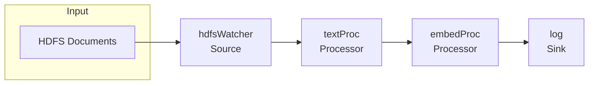
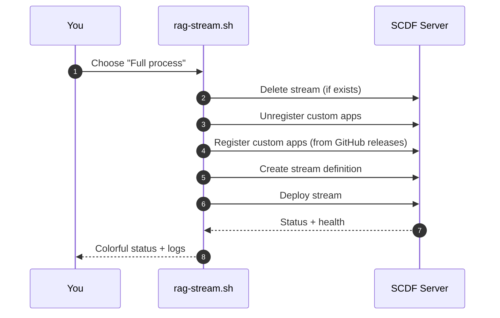

<div align="center">
  
  
  <h2>SCDF‑RAG • Spring Cloud Data Flow RAG Pipeline Manager</h2>

  <p>
    
    
    
    
    
  </p>
  
  <p><b>Central Command:</b> <code>rag-stream.sh</code> — a colorful, interactive CLI to build, register, deploy, monitor, and test your RAG streams.</p>
</div>

---

### ✨ What is SCDF‑RAG?

SCDF‑RAG is a focused toolkit to orchestrate Retrieval‑Augmented Generation pipelines on Spring Cloud Data Flow (SCDF). While there are legacy helpers in this repo, the star of the show is the streamlined, production‑minded <code>rag-stream.sh</code>.

## 🎯 Core Features

- **Interactive Stream Management**: Deploy, monitor, and manage RAG pipelines via a guided menu
- **Multi‑Environment Config**: Switch contexts with `--env` (e.g., default, staging, production)
- **Automatic App Registration**: Pull latest app releases from GitHub and register with SCDF
- **Version‑Aware Operations**: Surface versions at registration and deployment time
- **Comprehensive Logging**: Colorful console output + structured file logs
- **Token Caching & Refresh**: OAuth2 token reuse with auto‑refresh
- **Instance Scaling**: Control processor parallelism with deployment properties

## 🚀 Quick Start

### Prerequisites

Install required tools:
```bash
# macOS
brew install kubectl helm yq jq curl

# Linux
sudo apt-get install kubectl helm yq jq curl
```

### Setup

1. **Clone the repository**:
   ```bash
   git clone <repository-url>
   cd SCDF-RAG
   ```

2. **Configure your environment**:
   ```bash
   cp config.template.yaml config.yaml
   # Edit config.yaml with your SCDF server details
   ```

3. **Run the interactive manager**:
   ```bash
   ./rag-stream.sh
   ```

## 📋 Main Menu Options (rag‑stream)

The `rag-stream.sh` interactive menu includes:

- **View custom apps** — Display registered apps with versions
- **Unregister and register custom apps** — Refresh app registrations
- **Delete stream** — Remove existing streams
- **Create stream definition only** — Define without deployment
- **Deploy stream only** — Deploy an existing definition
- **Create and deploy stream** — End‑to‑end lifecycle
- **Full process** — Clean and rebuild (delete → register → create → deploy)
- **Show stream status** — Stream and app health
- **Launch testing menu** — Purpose‑built HDFS/TextProc tests

```text
SCDF rag-stream Pipeline Manager
1) View custom apps
2) Unregister and register custom apps (refresh)
3) Delete stream
4) Create stream definition only
5) Deploy stream only
6) Create and deploy stream (combined)
7) Full process (register, delete, create+deploy)
8) Show stream status
t) Launch testing menu
q) Quit
```

## 🔧 Configuration

### Environment Configuration

The system uses a hierarchical configuration approach:

1. **Default settings** in `config.yaml`
2. **Environment-specific overrides** (e.g., `production` section)
3. **Environment variable overrides**

```yaml
# config.yaml
default:
  scdf:
    url: "https://your-scdf-server.com"
    token_url: "https://your-oauth-server.com/oauth/token"
  
  apps:
    hdfsWatcher:
      type: "source"
      github_url: "https://github.com/dbbaskette/hdfsWatcher"
    textProc:
      type: "processor" 
      github_url: "https://github.com/dbbaskette/textProc"
    embedProc:
      type: "processor"
      github_url: "https://github.com/dbbaskette/embedProc"

  stream:
    name: "rag-stream"
    definition: "hdfsWatcher | textProc | embedProc | log"
    deployment_properties:
      deployer.textProc.count: 1
      deployer.embedProc.count: 4
      # ... additional properties
```

### Environment-Specific Settings

```bash
# Use production environment
./rag-stream.sh --env production

# Use custom environment
./rag-stream.sh --env staging
```

## 🔄 RAG Pipeline Components

### Core Applications

- **hdfsWatcher** (Source): Monitors HDFS for new documents
- **textProc** (Processor): Extracts and processes text content
- **embedProc** (Processor): Generates vector embeddings
- **log** (Sink): Outputs results for monitoring

### Pipeline Flow



### Lifecycle (at a glance)



## 🛠️ Advanced Usage

### Command Line Options

```bash
./rag-stream.sh [options]

Options:
  --no-prompt    Run full process automatically
  --tests        Launch testing menu
  --help         Show help message
  --debug        Enable debug logging
  --env <env>    Specify environment (default, production, etc.)
```

### Testing Different Configurations

```bash
# Launch testing menu
./rag-stream.sh --tests

# Test HDFS pipeline
./rag-stream.sh --tests
# Then select option 1: Test HDFS (hdfsWatcher → log)

# Test TextProc pipeline  
./rag-stream.sh --tests
# Then select option 2: Test TextProc (hdfsWatcher → textProc → log)
```

### Instance Scaling

Control the number of processor instances:

```yaml
# In config.yaml
deployment_properties:
  deployer.textProc.count: 2    # 2 textProc instances
  deployer.embedProc.count: 4   # 4 embedProc instances
```

### Environment Variables

Override any configuration setting:

```bash
export SCDF_URL="https://my-scdf-server.com"
export SCDF_TOKEN_URL="https://my-oauth-server.com/oauth/token"
./rag-stream.sh
```

## 📊 Monitoring and Logs

### Stream Status

Check stream and app health:
```bash
./rag-stream.sh
# Select option 8: Show stream status
```

### Logs

All operations are logged to `logs/rag-stream-YYYYMMDD-HHMMSS.log` with:
- Timestamps and context
- Success/error status
- API responses
- Configuration details

### Debug Mode

Enable detailed logging:
```bash
./rag-stream.sh --debug
```

## 🔐 Authentication

The system supports OAuth2 token‑based authentication:

1. **Token caching**: Tokens are stored in `.cf_token` and reused
2. **Auto‑refresh**: Invalid tokens trigger new authentication
3. **Secure storage**: Token files have restricted permissions

## 🏗️ Architecture

### File Structure

```
SCDF-RAG/
├── rag-stream.sh              # Main interactive manager
├── config.yaml                # Configuration (create from template)
├── config.template.yaml       # Configuration template
├── functions/                 # Modular function libraries
│   ├── config.sh             # Configuration management
│   ├── auth.sh               # Authentication handling
│   ├── rag_apps.sh           # App registration
│   ├── rag_streams.sh        # Stream operations
│   └── utilities.sh          # Utility functions
├── logs/                     # Operation logs
└── resources/                # Additional resources
```

### Key Components

- **Configuration Management**: Hierarchical config with environment support
- **App Registration**: Dynamic GitHub release fetching and registration
- **Stream Operations**: Create, deploy, monitor, and manage streams
- **Error Handling**: Comprehensive error handling with retry logic
- **Logging**: Context‑aware logging with file and console output

## 🧭 Why rag‑stream.sh?

- **Single entrypoint**: One script to register apps, create definitions, deploy, and monitor
- **Production‑friendly**: Opinionated defaults, retries, timeouts, and clear exit codes
- **Fast iteration**: Built‑in testing menu for HDFS/TextProc flows
- **Colorful UX**: Rich, readable terminal output with concise logs

## 🔧 Development

### Adding New Apps

1. Add app definition to `config.yaml`:
```yaml
   apps:
     myNewApp:
       type: "processor"
       github_url: "https://github.com/your-org/your-app"
   ```

2. The system will automatically:
   - Fetch the latest release from GitHub
   - Register the app with SCDF
   - Display version information

### Customizing Deployment Properties

Modify `deployment_properties` in `config.yaml`:

```yaml
deployment_properties:
  # Instance scaling
  deployer.textProc.count: 2
  deployer.embedProc.count: 4
  
  # Memory allocation
  deployer.textProc.memory: "4096M"
  deployer.embedProc.memory: "2048M"
  
  # Custom properties
  app.textProc.custom.property: "value"
```

## 📝 Legacy Components

> The SCDF installation helpers (e.g., `scdf_install_k8s.sh`) are legacy/testing utilities. The core functionality is centered on `rag-stream.sh`.

For SCDF installation, refer to the official docs: [Spring Cloud Data Flow installation](https://dataflow.spring.io/docs/installation/).

## 🤝 Contributing

1. Fork the repository
2. Create a feature branch
3. Make your changes
4. Test thoroughly
5. Submit a pull request

## 📄 License

MIT License — see LICENSE for details.

---

**Core**: `rag-stream.sh` — Interactive RAG pipeline management  
**Config**: `config.yaml` — Environment‑specific settings  
**Docs**: Inline function docs + this README
